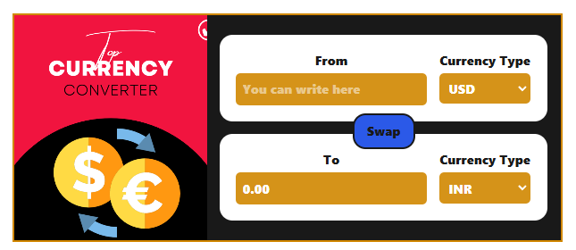

# Currency Converter

A simple and interactive Currency Converter app built using React. This application allows users to convert amounts between different currencies in real-time.

## Features

- Convert currency from one type to another
- Live exchange rate updates
- Swap currency functionality
- User-friendly interface with Tailwind CSS styling

## Tech Stack

- **React** - For UI components and state management
- **Custom Hooks** - Used for fetching exchange rates
- **Tailwind CSS** - For modern and responsive styling

## Installation & Setup

1. Clone the repository:
   ```bash
   git clone https://github.com/your-username/currency-converter.git
   ```
2. Navigate to the project directory:
   ```bash
   cd currency-converter
   ```
3. Install dependencies:
   ```bash
   npm install
   ```
4. Start the application:
   ```bash
   npm start
   ```

## Usage

- Enter the amount in the **From** field.
- Select the currencies you want to convert between.
- Click the **Swap** button to switch currencies.
- The converted amount will be displayed in the **To** field.

## Screenshots



## Folder Structure

```
Currency-Converter/
│── src/
│   ├── assets/         # Images & static assets
│   ├── CustomHook/     # Custom hook for fetching exchange rates
│   ├── App.js          # Main application component
│   ├── index.js        # Entry point
│── public/             # Public assets
│── package.json        # Dependencies & scripts
│── README.md           # Project Documentation
```

## Contributing

Contributions are welcome! If you find any bugs or want to add new features, feel free to fork the repository and submit a pull request.

## License

This project is open-source and available under the [MIT License](LICENSE).

